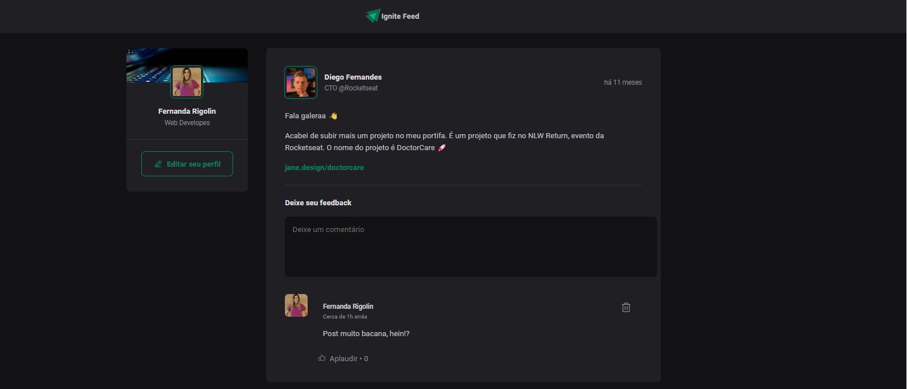
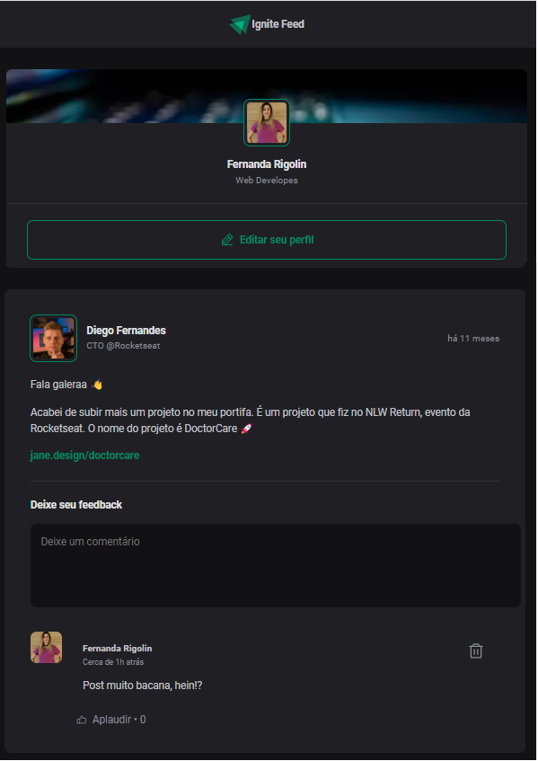

<div align="center">
  
</div>

###

<h1 align="center">Ignite Feed<br><br>Ignite - React da Rocketseat.</h1>

###

<h3 align="center">Desktop</h3>

###

<div align="center">
  
</div>

###

<h3 align="center">Mobile</h3>

###

<div align="center">
  
</div>

###

<br clear="both">

<h2 align="left">Tecnologias</h2>

###

<div align="center">
  
  
  
  
  
</div>

###

## Rodando o projeto

Clone o projeto.

```bash
$ git clone https://github.com/FernandaZaccaroRigolin/FeedReact.git

```

Siga os passos abaixo:

```bash
# Instalação de dependencias
$ yarn or npm i
# Iniciar o projeto
$ yarn dev or npm run dev
```

O aplicativo estará disponível para acesso em seu navegador em http://localhost:3000
